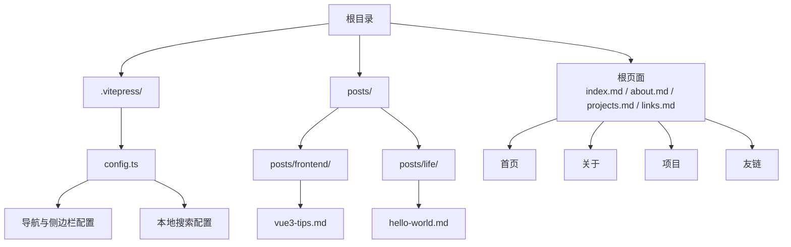
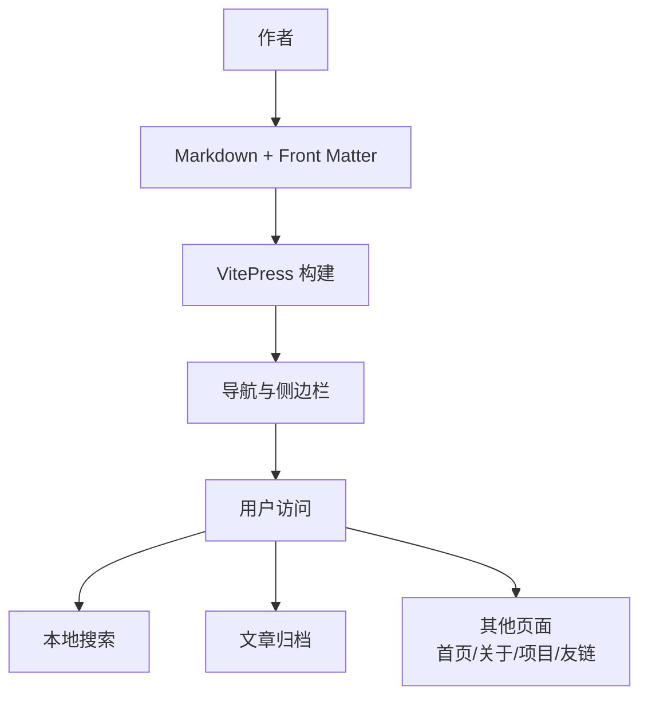
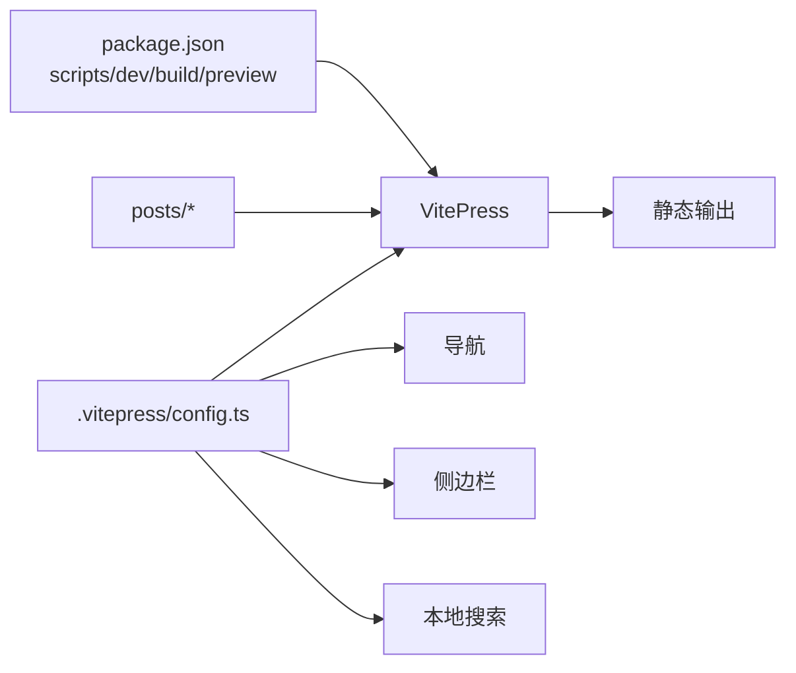

# 内容管理

<cite>
**本文引用的文件**
- [.vitepress/config.ts](file://.vitepress/config.ts)
- [posts/index.md](file://posts/index.md)
- [posts/frontend/vue3-tips.md](file://posts/frontend/vue3-tips.md)
- [posts/life/hello-world.md](file://posts/life/hello-world.md)
- [index.md](file://index.md)
- [about.md](file://about.md)
- [projects.md](file://projects.md)
- [links.md](file://links.md)
- [package.json](file://package.json)
</cite>

## 目录
1. [引言](#引言)
2. [项目结构](#项目结构)
3. [核心组件](#核心组件)
4. [架构总览](#架构总览)
5. [详细组件分析](#详细组件分析)
6. [依赖关系分析](#依赖关系分析)
7. [性能考虑](#性能考虑)
8. [故障排除指南](#故障排除指南)
9. [结论](#结论)
10. [附录](#附录)

## 引言
本文件面向内容管理者与作者，系统性说明该内容管理系统的博客文章创建、组织与管理流程，涵盖 Front Matter 元数据字段规范、分类体系、写作与排版最佳实践、文章链接注册与导航配置，以及常见场景的处理方案。系统基于 VitePress 构建，采用 Markdown + Front Matter 的静态站点生成方式，通过主题配置集中管理导航与侧边栏。

## 项目结构
该仓库采用“内容优先”的目录组织方式：
- 根目录包含首页、关于、项目、友链等页面
- posts 目录用于存放所有文章，按分类子目录组织
- .vitepress/config.ts 为站点与主题配置中心，定义导航、侧边栏、搜索、SEO 等

图表来源
- [.vitepress/config.ts:28-45](file://.vitepress/config.ts#L28-L45)
- [posts/index.md:1-24](file://posts/index.md#L1-L24)
- [posts/frontend/vue3-tips.md:1-10](file://posts/frontend/vue3-tips.md#L1-L10)
- [posts/life/hello-world.md:1-10](file://posts/life/hello-world.md#L1-L10)

章节来源
- [.vitepress/config.ts:16-93](file://.vitepress/config.ts#L16-L93)
- [posts/index.md:1-24](file://posts/index.md#L1-L24)

## 核心组件
- 站点配置与主题：负责站点标题、SEO、导航、侧边栏、搜索、页脚、语言与本地化等
- 文章内容：采用 Markdown + Front Matter 的形式，Front Matter 提供标题、日期、分类、标签、描述等元数据
- 归档页面：统一展示文章列表与分类索引
- 页面入口：首页、关于、项目、友链等页面作为内容入口与导航补充

章节来源
- [.vitepress/config.ts:3-94](file://.vitepress/config.ts#L3-L94)
- [posts/frontend/vue3-tips.md:1-10](file://posts/frontend/vue3-tips.md#L1-L10)
- [posts/life/hello-world.md:1-10](file://posts/life/hello-world.md#L1-L10)
- [posts/index.md:1-24](file://posts/index.md#L1-L24)

## 架构总览
下图展示了从内容创作到用户访问的关键路径：作者编写 Markdown + Front Matter → VitePress 构建 → 导航与侧边栏呈现 → 本地搜索与归档索引。

图表来源
- [.vitepress/config.ts:20-45](file://.vitepress/config.ts#L20-L45)
- [posts/index.md:9-17](file://posts/index.md#L9-L17)

## 详细组件分析

### Front Matter 元数据规范
Front Matter 是 YAML 格式的元数据块，位于文章开头，用于声明文章的基本属性与 SEO 信息。建议字段如下：

- title：文章标题（字符串）
- date：发布日期（YYYY-MM-DD）
- category：分类（字符串，如“前端”“生活随笔”）
- tags：标签数组（字符串数组）
- description：文章摘要（字符串）

字段作用与格式要求
- title：影响页面标题与导航显示，建议简洁明确
- date：用于排序与归档展示，格式严格为 YYYY-MM-DD
- category：决定文章归属的分类目录，需与侧边栏配置一致
- tags：便于检索与聚合，建议控制数量与相关性
- description：影响 SEO 与摘要展示，建议在 100 字以内

参考示例路径
- [Front Matter 示例（前端）:1-9](file://posts/frontend/vue3-tips.md#L1-L9)
- [Front Matter 示例（生活）:1-9](file://posts/life/hello-world.md#L1-L9)

章节来源
- [posts/frontend/vue3-tips.md:1-10](file://posts/frontend/vue3-tips.md#L1-L10)
- [posts/life/hello-world.md:1-10](file://posts/life/hello-world.md#L1-L10)

### 分类系统与目录组织
- 目录结构：posts/frontend 与 posts/life 两个分类目录分别承载不同类别的文章
- 分类用途：
  - 前端：技术类文章（如 Vue3 开发技巧）
  - 生活随笔：非技术类随笔与思考
- 归档页面：posts/index.md 统一列出各年份与分类下的文章清单，支持快速跳转

参考示例路径
- [分类目录结构:11-17](file://posts/index.md#L11-L17)
- [前端文章示例:11-13](file://posts/frontend/vue3-tips.md#L11-L13)
- [生活文章示例:11-13](file://posts/life/hello-world.md#L11-L13)

章节来源
- [posts/index.md:11-17](file://posts/index.md#L11-L17)
- [posts/frontend/vue3-tips.md:11-57](file://posts/frontend/vue3-tips.md#L11-L57)
- [posts/life/hello-world.md:11-37](file://posts/life/hello-world.md#L11-L37)

### 文章链接注册与侧边栏配置
- 侧边栏配置：在 .vitepress/config.ts 的 sidebar 中为每个分类添加条目，并在 items 中逐项注册文章链接
- 注册步骤：
  1) 在 posts/<分类> 下新增文章
  2) 在 posts/index.md 中确认归档链接已生成
  3) 在 .vitepress/config.ts 的 sidebar 对应分类下添加新文章的链接项
- 导航联动：顶部导航中的“文章”链接指向 posts/，侧边栏提供分类与具体文章的层级导航

参考示例路径
- [侧边栏配置（前端/生活）:28-44](file://.vitepress/config.ts#L28-L44)
- [文章归档页面:1-24](file://posts/index.md#L1-L24)

章节来源
- [.vitepress/config.ts:28-44](file://.vitepress/config.ts#L28-L44)
- [posts/index.md:1-24](file://posts/index.md#L1-L24)

### 写作与排版最佳实践
- 标题层级：使用 H1 作为主标题，H2/H3 作为章节与子节，保持层级清晰
- 列表与强调：使用有序/无序列表组织要点；使用引用块突出金句
- 代码块：为代码片段设置语言标识，提升可读性
- 图片插入：建议放置于 public 目录并在文章中以相对路径引用，确保构建后可访问
- 长文分段：合理使用空行与分节，增强阅读体验

参考示例路径
- [标题与引用示例（前端）:11-13](file://posts/frontend/vue3-tips.md#L11-L13)
- [标题与引用示例（生活）:11-13](file://posts/life/hello-world.md#L11-L13)
- [代码块示例（前端）:19-27](file://posts/frontend/vue3-tips.md#L19-L27)

章节来源
- [posts/frontend/vue3-tips.md:11-57](file://posts/frontend/vue3-tips.md#L11-L57)
- [posts/life/hello-world.md:11-37](file://posts/life/hello-world.md#L11-L37)

### 本地搜索与导航
- 本地搜索：在主题配置中启用本地搜索，支持中文分词与快捷键导航
- 目录大纲：自动抽取 H2/H3 标题生成目录，辅助长文阅读
- 页脚与版权：统一的页脚信息与版权声明，提升品牌一致性

参考示例路径
- [本地搜索配置:73-92](file://.vitepress/config.ts#L73-L92)
- [目录大纲配置:56-59](file://.vitepress/config.ts#L56-L59)
- [页脚配置:51-54](file://.vitepress/config.ts#L51-L54)

章节来源
- [.vitepress/config.ts:51-92](file://.vitepress/config.ts#L51-L92)

### 页面入口与内容扩展
- 首页：包含英雄区与特性卡片，引导访问文章与其他页面
- 关于：个人介绍与技能概览，建立作者形象
- 项目：展示当前进行与未来计划的项目
- 友链：交换链接的模板与规范，便于社区互动

参考示例路径
- [首页 Hero 区域:4-17](file://index.md#L4-L17)
- [关于页面:1-41](file://about.md#L1-L41)
- [项目页面:1-34](file://projects.md#L1-L34)
- [友链页面:1-43](file://links.md#L1-L43)

章节来源
- [index.md:1-30](file://index.md#L1-L30)
- [about.md:1-41](file://about.md#L1-L41)
- [projects.md:1-34](file://projects.md#L1-L34)
- [links.md:1-43](file://links.md#L1-L43)

## 依赖关系分析
- 构建工具链：基于 VitePress 与 Vue3，通过 package.json 的 scripts 启动开发、构建与预览
- 主题与配置：.vitepress/config.ts 作为单一事实源，集中管理导航、侧边栏、搜索、SEO 等
- 内容耦合：文章的 category 与侧边栏 items 必须保持一致，否则会出现导航缺失或 404

图表来源
- [package.json:6-10](file://package.json#L6-L10)
- [.vitepress/config.ts:3-94](file://.vitepress/config.ts#L3-L94)

章节来源
- [package.json:1-23](file://package.json#L1-L23)
- [.vitepress/config.ts:3-94](file://.vitepress/config.ts#L3-L94)

## 性能考虑
- 构建体积：减少大图片与冗余资源，必要时压缩或懒加载
- 链接有效性：新增文章后及时更新侧边栏，避免无效链接导致的二次渲染
- 搜索索引：本地搜索在内容较多时会增加构建时间，建议控制文章数量与长度
- 预览与缓存：使用 vitepress preview 进行本地验证，减少线上问题

## 故障排除指南
- 新增文章后导航缺失
  - 检查 posts/<分类>/<slug>.md 是否存在
  - 在 .vitepress/config.ts 的 sidebar 对应分类下添加新文章链接
  - 参考：[侧边栏配置:28-44](file://.vitepress/config.ts#L28-L44)
- 日期格式错误导致排序异常
  - 确保 Front Matter 的 date 使用 YYYY-MM-DD 格式
  - 参考：[Front Matter 示例:1-9](file://posts/frontend/vue3-tips.md#L1-L9)
- 归档页面未更新
  - 在 posts/index.md 中确认分类与链接已同步
  - 参考：[文章归档页面:1-24](file://posts/index.md#L1-L24)
- 本地搜索无结果
  - 检查 .vitepress/config.ts 的 search.provider 与本地化文案
  - 参考：[本地搜索配置:73-92](file://.vitepress/config.ts#L73-L92)

章节来源
- [.vitepress/config.ts:28-44](file://.vitepress/config.ts#L28-L44)
- [posts/frontend/vue3-tips.md:1-9](file://posts/frontend/vue3-tips.md#L1-L9)
- [posts/index.md:1-24](file://posts/index.md#L1-L24)
- [.vitepress/config.ts:73-92](file://.vitepress/config.ts#L73-L92)

## 结论
该内容管理系统以简洁清晰的方式实现了博客文章的创建、组织与管理：通过标准化的 Front Matter 元数据、清晰的目录与侧边栏配置、以及本地搜索与归档页面，形成从内容创作到读者阅读的完整闭环。遵循本文提供的规范与流程，可高效地维护与扩展内容体系。

## 附录

### 常见写作场景处理方案
- 多语言代码块：为每段代码指定语言，便于高亮与复制
  - 参考：[代码块示例（前端）:19-27](file://posts/frontend/vue3-tips.md#L19-L27)
- 引用与金句：使用引用块突出观点，增强可读性
  - 参考：[引用示例（前端）](file://posts/frontend/vue3-tips.md#L13)
  - 参考：[引用示例（生活）](file://posts/life/hello-world.md#L13)
- 图片与资源：将图片放入 public 并在文章中以相对路径引用
  - 参考：[首页头像引用:8-10](file://index.md#L8-L10)
- 标题层级与目录：使用 H1/H2/H3 控制结构，配合本地搜索与目录大纲
  - 参考：[目录大纲配置:56-59](file://.vitepress/config.ts#L56-L59)

章节来源
- [posts/frontend/vue3-tips.md:13-27](file://posts/frontend/vue3-tips.md#L13-L27)
- [posts/life/hello-world.md:13-13](file://posts/life/hello-world.md#L13-L13)
- [index.md:8-10](file://index.md#L8-L10)
- [.vitepress/config.ts:56-59](file://.vitepress/config.ts#L56-L59)