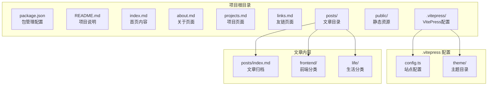
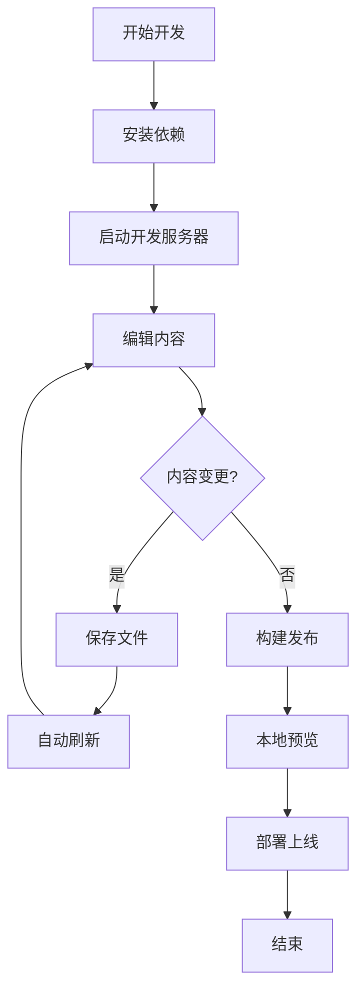

# 快速开始

<cite>
**本文引用的文件**
- [package.json](file://package.json)
- [README.md](file://README.md)
- [.vitepress/config.ts](file://.vitepress/config.ts)
- [index.md](file://index.md)
- [about.md](file://about.md)
- [projects.md](file://projects.md)
- [links.md](file://links.md)
- [posts/index.md](file://posts/index.md)
- [posts/frontend/vue3-tips.md](file://posts/frontend/vue3-tips.md)
- [posts/life/hello-world.md](file://posts/life/hello-world.md)
- [.gitignore](file://.gitignore)
</cite>

## 目录
1. [简介](#简介)
2. [项目结构](#项目结构)
3. [环境要求](#环境要求)
4. [安装依赖](#安装依赖)
5. [启动开发服务器](#启动开发服务器)
6. [构建与预览](#构建与预览)
7. [基础配置说明](#基础配置说明)
8. [本地开发流程](#本地开发流程)
9. [常见问题解决](#常见问题解决)
10. [结语](#结语)

## 简介

这是一个基于 VitePress 构建的个人博客项目，采用 Vue3 + TypeScript 技术栈，提供极简文艺风格的静态网站生成能力。项目支持本地开发、构建和部署，适合个人技术博客、知识分享和创作展示。

## 项目结构



**图表来源**
- [README.md:14-34](file://README.md#L14-L34)
- [.vitepress/config.ts:1-95](file://.vitepress/config.ts#L1-L95)

**章节来源**
- [README.md:14-34](file://README.md#L14-L34)
- [package.json:1-23](file://package.json#L1-L23)

## 环境要求

### Node.js 版本要求

项目需要满足以下环境要求：
- **Node.js**: 18 或更高版本
- **包管理器**: 推荐使用 pnpm，也可使用 npm 或 yarn

### 依赖关系

项目的核心依赖包括：
- **vitepress**: ^1.5.0 - 静态站点生成器
- **vue**: ^3.5.13 - 前端框架
- **开发依赖**: 支持 TypeScript 和现代化 JavaScript 特性

**章节来源**
- [package.json:18-21](file://package.json#L18-L21)
- [README.md:7-12](file://README.md#L7-L12)

## 安装依赖

### 使用 pnpm（推荐）

```bash
# 安装项目依赖
pnpm install
```

### 其他包管理器选项

```bash
# 使用 npm
npm install

# 使用 yarn
yarn install
```

### 依赖安装验证

安装完成后，确认以下文件存在：
- `node_modules/` 目录
- `package-lock.json` 或 `yarn.lock` 文件
- VitePress 和 Vue 相关依赖已正确安装

**章节来源**
- [README.md:38-50](file://README.md#L38-L50)
- [.gitignore:1-16](file://.gitignore#L1-L16)

## 启动开发服务器

### 开发服务器启动

```bash
# 启动开发服务器
pnpm dev
```

### 开发服务器特性

- **热重载**: 修改文件后自动刷新
- **实时预览**: 浏览器实时显示更改效果
- **错误提示**: 显示详细的编译错误信息
- **源码映射**: 支持调试原始源码

### 访问验证

开发服务器启动后，在浏览器中访问：
- **默认地址**: http://localhost:5173
- **自定义端口**: 如需修改端口，请查看 VitePress 配置

**章节来源**
- [README.md:38-50](file://README.md#L38-L50)
- [package.json:6-10](file://package.json#L6-L10)

## 构建与预览

### 构建静态文件

```bash
# 构建生产环境静态文件
pnpm build
```

构建过程会：
- 编译所有 Markdown 文件
- 生成静态 HTML 页面
- 优化和压缩资源文件
- 输出到 `.vitepress/dist/` 目录

### 本地预览构建结果

```bash
# 本地预览构建结果
pnpm preview
```

预览功能：
- 启动本地静态服务器
- 服务构建后的静态文件
- 模拟生产环境行为

**章节来源**
- [README.md:38-50](file://README.md#L38-L50)
- [package.json:6-10](file://package.json#L6-L10)

## 基础配置说明

### VitePress 站点配置

项目的核心配置位于 `.vitepress/config.ts`，主要包含：

#### 基础信息配置
- **站点标题**: "chen 的博客"
- **描述**: "记录技术、生活与思考"
- **语言**: zh-CN
- **URL 清理**: 启用 cleanUrls

#### 头部配置
- **favicon**: `/favicon.ico`
- **作者信息**: 自定义作者元数据
- **关键词**: 中文关键词优化

#### 导航配置
- **主导航**: 首页、文章、项目、关于、友链
- **社交链接**: GitHub 链接
- **面包屑**: 支持文档导航

#### 侧边栏配置
- **文章分类**: 前端、生活随笔
- **文章链接**: Vue3 开发小技巧、你好，世界

#### 主题配置
- **搜索功能**: 本地搜索，支持中文
- **页脚信息**: 版权声明和站点信息
- **主题切换**: 支持明暗主题切换

**章节来源**
- [.vitepress/config.ts:1-95](file://.vitepress/config.ts#L1-L95)

### 页面内容配置

#### 首页配置
首页通过 `index.md` 的 YAML frontmatter 配置：
- **布局**: home
- **英雄区域**: 名称、标语、行动按钮
- **特色功能**: 写作、编码、生活三个核心板块

#### 其他页面
- **关于页面**: 个人介绍和技术栈
- **项目页面**: 项目作品展示
- **友链页面**: 友情链接申请格式

**章节来源**
- [index.md:1-30](file://index.md#L1-L30)
- [about.md:1-41](file://about.md#L1-L41)
- [projects.md:1-34](file://projects.md#L1-L34)
- [links.md:1-43](file://links.md#L1-L43)

## 本地开发流程

### 完整开发工作流



### 开发步骤详解

1. **环境准备**
   - 确保 Node.js 版本符合要求
   - 选择合适的包管理器（推荐 pnpm）

2. **项目初始化**
   ```bash
   # 克隆项目后安装依赖
   pnpm install
   
   # 启动开发服务器
   pnpm dev
   ```

3. **内容创作**
   - 在 `posts/<分类>/` 目录下创建新的 Markdown 文件
   - 遵循现有文章的 YAML frontmatter 格式
   - 在 `.vitepress/config.ts` 中添加侧边栏链接

4. **本地测试**
   - 浏览器访问 http://localhost:5173
   - 验证页面显示和功能正常
   - 使用 `pnpm preview` 预览构建结果

5. **构建发布**
   ```bash
   # 生成生产环境文件
   pnpm build
   
   # 本地预览
   pnpm preview
   ```

**章节来源**
- [README.md:36-72](file://README.md#L36-L72)
- [posts/frontend/vue3-tips.md:1-57](file://posts/frontend/vue3-tips.md#L1-L57)
- [posts/life/hello-world.md:1-37](file://posts/life/hello-world.md#L1-L37)

## 常见问题解决

### 依赖安装问题

**问题**: pnpm 安装失败
**解决方案**:
```bash
# 清理缓存后重试
pnpm store prune
pnpm install

# 或使用其他包管理器
npm install
# 或
yarn install
```

**问题**: Node.js 版本不兼容
**解决方案**:
```bash
# 检查 Node.js 版本
node --version

# 升级到推荐版本（18+）
```

### 开发服务器问题

**问题**: 端口被占用
**解决方案**:
```bash
# 修改端口配置
# 在 .vitepress/config.ts 中调整 devServer 配置
```

**问题**: 热重载不生效
**解决方案**:
```bash
# 重启开发服务器
pnpm dev

# 清理缓存
rm -rf .vitepress/cache
```

### 构建问题

**问题**: 构建失败
**解决方案**:
```bash
# 清理构建缓存
rm -rf .vitepress/dist

# 重新构建
pnpm build
```

**问题**: 预览无法访问
**解决方案**:
```bash
# 确认构建完成
pnpm build

# 启动预览服务器
pnpm preview
```

### 内容显示问题

**问题**: 新增文章不显示在侧边栏
**解决方案**:
```typescript
// 在 .vitepress/config.ts 中添加侧边栏链接
sidebar: {
  '/posts/': [
    // ... 现有配置
    {
      text: '新分类',
      collapsed: false,
      items: [
        { text: '新文章', link: '/posts/分类/新文章' }
      ]
    }
  ]
}
```

**章节来源**
- [.gitignore:1-16](file://.gitignore#L1-L16)
- [.vitepress/config.ts:28-45](file://.vitepress/config.ts#L28-L45)

## 结语

通过以上步骤，您应该能够成功搭建并运行这个个人博客项目。VitePress 提供了优秀的开发体验和性能表现，配合 Vue3 的现代化特性，能够为您打造一个美观实用的技术博客。

### 后续建议

1. **内容规划**: 制定内容发布计划，保持更新频率
2. **SEO 优化**: 根据需要调整 meta 标签和关键词
3. **主题定制**: 在 `.vitepress/theme/` 目录下进行样式定制
4. **部署策略**: 考虑使用 Vercel 或 GitHub Pages 进行自动化部署

祝您创作愉快！