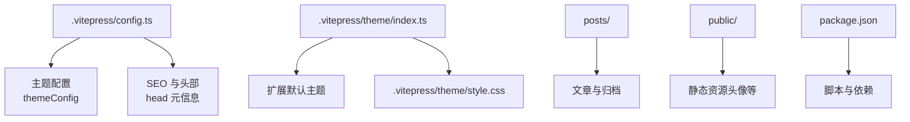
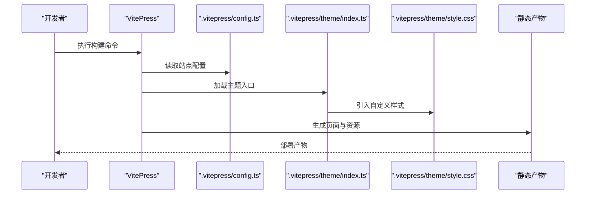
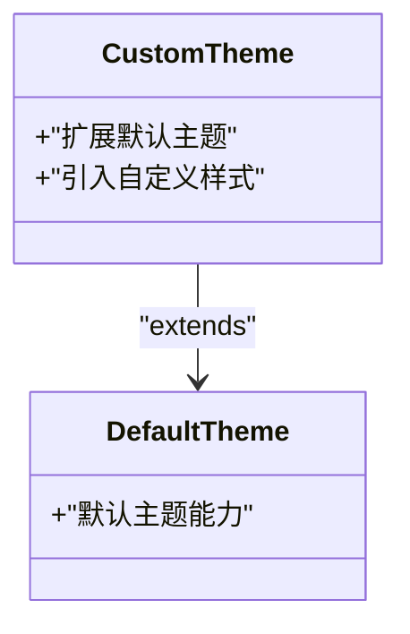
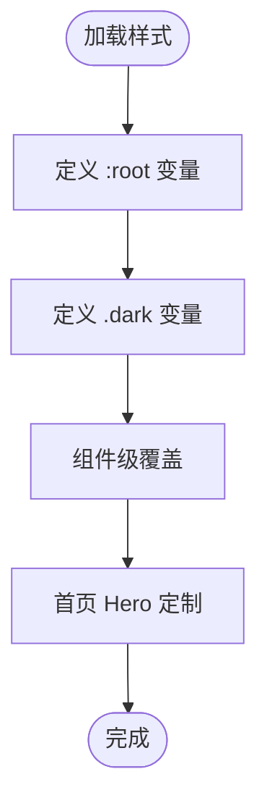
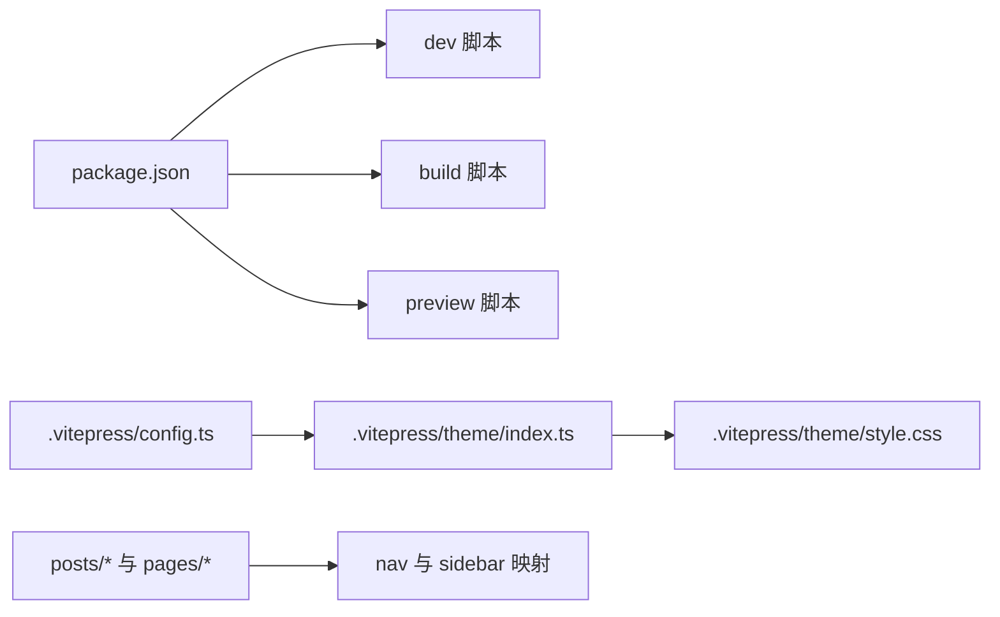

# 站点配置

<cite>
**本文引用的文件**
- [.vitepress/config.ts](file://.vitepress/config.ts)
- [.vitepress/theme/index.ts](file://.vitepress/theme/index.ts)
- [.vitepress/theme/style.css](file://.itepress/theme/style.css)
- [package.json](file://package.json)
- [index.md](file://index.md)
- [about.md](file://about.md)
- [projects.md](file://projects.md)
- [links.md](file://links.md)
- [posts/index.md](file://posts/index.md)
- [posts/frontend/vue3-tips.md](file://posts/frontend/vue3-tips.md)
- [posts/life/hello-world.md](file://posts/life/hello-world.md)
- [README.md](file://README.md)
</cite>

## 目录
1. [简介](#简介)
2. [项目结构](#项目结构)
3. [核心配置项解析](#核心配置项解析)
4. [架构概览](#架构概览)
5. [组件与主题详解](#组件与主题详解)
6. [依赖关系分析](#依赖关系分析)
7. [性能与可用性建议](#性能与可用性建议)
8. [故障排查指南](#故障排查指南)
9. [结论](#结论)
10. [附录：配置项速查表](#附录配置项速查表)

## 简介
本文件面向 VitePress 站点的配置与主题定制，围绕 .vitepress/config.ts 的核心配置、导航与侧边栏、SEO 与元信息、主题入口与样式体系展开，同时给出响应式与暗黑模式的实现要点、最佳实践与常见场景解决方案。读者可据此快速完成从基础配置到深度定制的全链路落地。

## 项目结构
该站点采用标准 VitePress 结构：
- .vitepress/config.ts：站点全局配置（标题、描述、语言、SEO 头部、导航、侧边栏、搜索、主题文案等）
- .vitepress/theme/index.ts：主题入口，扩展默认主题并引入自定义样式
- .vitepress/theme/style.css：自定义样式变量与组件级覆盖（含浅色/深色主题）
- posts/：Markdown 文章与归档页面
- public/：静态资源（如头像）
- 站点根目录文档：首页、关于、项目、友链等

图表来源
- [.vitepress/config.ts:1-95](file://.vitepress/config.ts#L1-L95)
- [.vitepress/theme/index.ts:1-8](file://.vitepress/theme/index.ts#L1-L8)
- [.vitepress/theme/style.css:1-142](file://.vitepress/theme/style.css#L1-L142)
- [package.json:1-23](file://package.json#L1-L23)

章节来源
- [.vitepress/config.ts:1-95](file://.vitepress/config.ts#L1-L95)
- [.vitepress/theme/index.ts:1-8](file://.vitepress/theme/index.ts#L1-L8)
- [.vitepress/theme/style.css:1-142](file://.vitepress/theme/style.css#L1-L142)
- [package.json:1-23](file://package.json#L1-L23)

## 核心配置项解析
本节逐项解读 .vitepress/config.ts 中的关键配置，帮助你理解每个字段的作用、默认行为与可选值范围。

- 基础信息与语言
  - title：站点标题，用于浏览器标签与 SEO 标题
  - description：站点描述，用于 SEO 描述
  - lang：界面语言代码，默认 zh-CN
  - cleanUrls：启用干净 URL，移除 .html 后缀
  - lastUpdated：启用页面最后更新时间显示

- SEO 与头部
  - head：数组形式注入 meta 与 link 标签，如 favicon、作者、关键词等

- 主题配置（themeConfig）
  - siteTitle：主导航左侧显示的站点名
  - logo：导航栏左侧图标路径
  - nav：主导航条目数组，每项包含文本与链接
  - sidebar：按路径前缀分组的侧边栏结构，支持折叠与层级
  - socialLinks：社交链接列表（如 GitHub）
  - footer：页脚信息，包含 message 与 copyright
  - outline：右侧大纲层级与标题
  - docFooter：文档底部“上一篇/下一篇”文案
  - lastUpdatedText、returnToTopLabel、sidebarMenuLabel、darkModeSwitchLabel、lightModeSwitchTitle、darkModeSwitchTitle：主题交互文案
  - search：搜索提供方与本地搜索的文案翻译

- 搜索配置（provider 与文案）
  - provider：本地搜索 local
  - options.translations：按钮与模态框文案（按钮提示、无障碍标签、无结果提示、清空、选择/切换/关闭等）

章节来源
- [.vitepress/config.ts:3-94](file://.vitepress/config.ts#L3-L94)

## 架构概览
VitePress 在构建阶段读取 config.ts，结合主题入口与样式，生成静态站点。主题入口通过扩展默认主题实现外观与交互的统一，样式层通过 CSS 变量与浅/深两类规则实现响应式与暗黑模式。

图表来源
- [.vitepress/config.ts:1-95](file://.vitepress/config.ts#L1-L95)
- [.vitepress/theme/index.ts:1-8](file://.vitepress/theme/index.ts#L1-L8)
- [.vitepress/theme/style.css:1-142](file://.vitepress/theme/style.css#L1-L142)

## 组件与主题详解
本节聚焦主题入口与样式体系，解释如何通过扩展默认主题与 CSS 变量实现深度定制。

### 主题入口（扩展默认主题）
- 扩展方式：通过 extends 默认主题，保留默认行为的同时叠加自定义样式
- 样式引入：在入口中导入自定义样式文件，确保样式在主题渲染前加载

图表来源
- [.vitepress/theme/index.ts:1-8](file://.vitepress/theme/index.ts#L1-L8)

章节来源
- [.vitepress/theme/index.ts:1-8](file://.vitepress/theme/index.ts#L1-L8)

### 样式体系（CSS 变量与浅/深主题）
- CSS 变量：通过 :root 定义主色调、字体族、背景与文字色阶
- 暗黑模式：.dark 类别下重新定义变量，实现自动切换
- 组件级覆盖：对导航栏、文章卡片、标题、引用、链接、代码块等进行风格化
- 首页 Hero：针对 VPHero 的字体与排版进行定制

图表来源
- [.vitepress/theme/style.css:1-142](file://.vitepress/theme/style.css#L1-L142)

章节来源
- [.vitepress/theme/style.css:1-142](file://.vitepress/theme/style.css#L1-L142)

### 页面与导航
- 首页（index.md）：通过 frontmatter 的 layout: home 与 hero/features 配置首页展示
- 关于（about.md）、项目（projects.md）、友链（links.md）：作为独立页面参与导航
- 文章归档（posts/index.md）：汇总分类与文章列表，配合 sidebar 的路径映射

章节来源
- [index.md:1-30](file://index.md#L1-L30)
- [about.md:1-41](file://about.md#L1-L41)
- [projects.md:1-34](file://projects.md#L1-L34)
- [links.md:1-43](file://links.md#L1-L43)
- [posts/index.md:1-24](file://posts/index.md#L1-L24)

## 依赖关系分析
- 构建与运行：package.json 提供 dev/build/preview 脚本，依赖 vitepress 与 vue
- 配置与主题：config.ts 与 theme/index.ts 彼此协作，前者提供站点配置，后者扩展主题并引入样式
- 内容与导航：各页面通过 nav 与 sidebar 的路径映射形成导航闭环

图表来源
- [package.json:1-23](file://package.json#L1-L23)
- [.vitepress/config.ts:1-95](file://.vitepress/config.ts#L1-L95)
- [.vitepress/theme/index.ts:1-8](file://.vitepress/theme/index.ts#L1-L8)
- [.vitepress/theme/style.css:1-142](file://.vitepress/theme/style.css#L1-L142)

章节来源
- [package.json:1-23](file://package.json#L1-L23)
- [.vitepress/config.ts:1-95](file://.vitepress/config.ts#L1-L95)
- [.vitepress/theme/index.ts:1-8](file://.vitepress/theme/index.ts#L1-L8)
- [.vitepress/theme/style.css:1-142](file://.vitepress/theme/style.css#L1-L142)

## 性能与可用性建议
- 清理 URL 与缓存：启用 cleanUrls 减少冗余后缀，合理利用浏览器缓存策略
- 图片与资源：将头像等静态资源放入 public 并使用相对路径，避免重复请求
- 搜索体验：本地搜索适合中小规模站点；大规模内容建议迁移至 Algolia 或自建搜索
- 暗黑模式：通过 CSS 变量与 .dark 类别实现平滑切换，避免复杂 JS 切换逻辑
- 字体与排版：尽量减少字体族数量，优先使用系统字体或轻量字体，提升首屏渲染

## 故障排查指南
- 无法访问新页面
  - 检查 .vitepress/config.ts 的 nav 与 sidebar 是否包含对应路径
  - 确认页面 frontmatter 的路径与实际文件一致
- 搜索无结果或文案不生效
  - 确认 search.provider 设置为 local
  - 检查 options.translations 的文案键是否完整
- 样式未生效
  - 确认 .vitepress/theme/index.ts 正确引入 style.css
  - 检查 CSS 变量命名与 .dark 类别是否匹配
- 暗黑模式切换异常
  - 确认系统或用户偏好未强制禁用暗色
  - 检查 .dark 类别下的变量覆盖是否完整

章节来源
- [.vitepress/config.ts:1-95](file://.vitepress/config.ts#L1-L95)
- [.vitepress/theme/index.ts:1-8](file://.vitepress/theme/index.ts#L1-L8)
- [.vitepress/theme/style.css:1-142](file://.vitepress/theme/style.css#L1-L142)

## 结论
通过 .vitepress/config.ts 的系统化配置与主题入口的扩展，结合 CSS 变量与浅/深主题覆盖，本项目实现了简洁而富有个性的站点风格。遵循本文的配置项说明、最佳实践与故障排查建议，你可以快速完成从基础到深度的定制，并在不同规模与场景下稳定运行。

## 附录：配置项速查表
- 基础信息与语言
  - title：字符串，站点标题
  - description：字符串，站点描述
  - lang：字符串，语言代码（如 zh-CN）
  - cleanUrls：布尔，启用干净 URL
  - lastUpdated：布尔，启用最后更新时间

- SEO 与头部
  - head：数组，包含多个 meta/link 标签对象

- 主题配置（themeConfig）
  - siteTitle：字符串，主导航左侧标题
  - logo：字符串，图标路径
  - nav：数组，导航条目（text/link）
  - sidebar：对象，按路径前缀组织的侧边栏（支持 collapsed 与 items）
  - socialLinks：数组，社交链接（icon/link）
  - footer：对象，message/copyright
  - outline：对象，level/label
  - docFooter：对象，prev/next
  - lastUpdatedText、returnToTopLabel、sidebarMenuLabel、darkModeSwitchLabel、lightModeSwitchTitle、darkModeSwitchTitle：字符串，主题文案
  - search：对象，provider/local 与 options.translations

- 搜索文案（options.translations）
  - button.buttonText、button.buttonAriaLabel
  - modal.noResultsText、modal.resetButtonTitle、modal.footer.selectText、modal.footer.navigateText、modal.footer.closeText

章节来源
- [.vitepress/config.ts:1-95](file://.vitepress/config.ts#L1-L95)