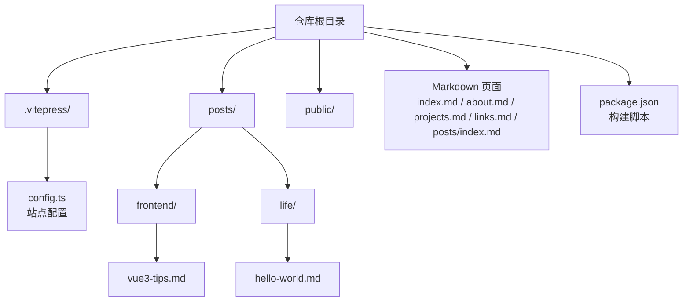
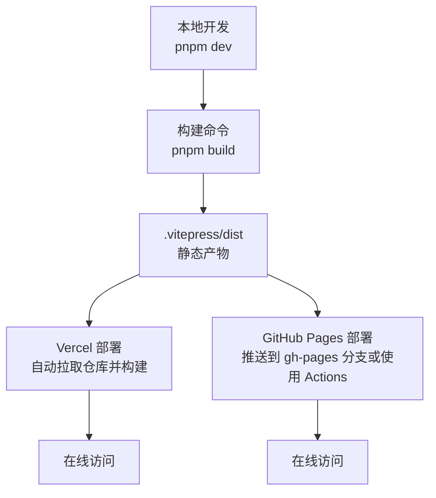
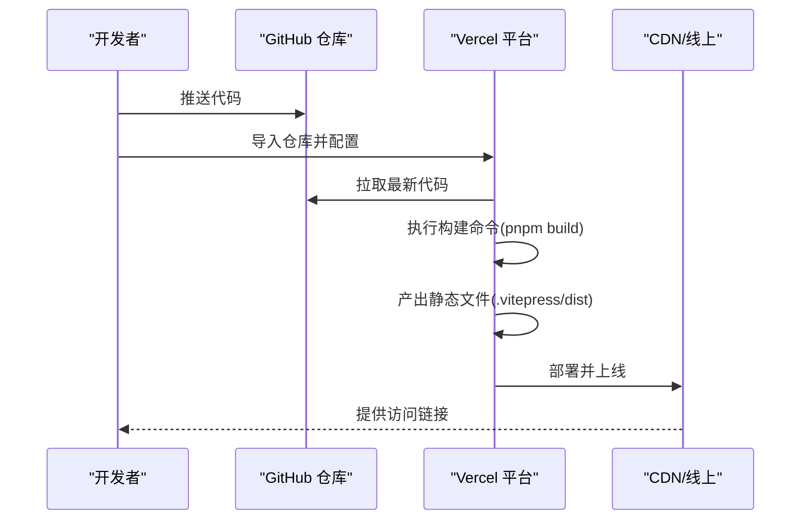
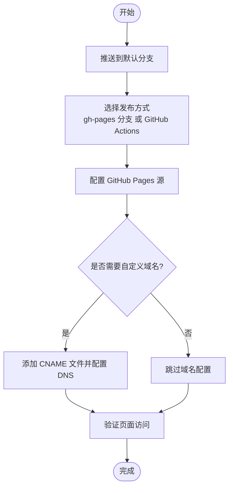
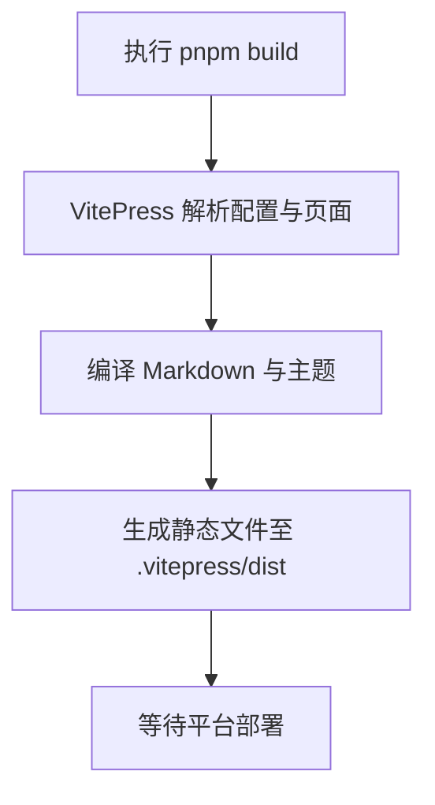
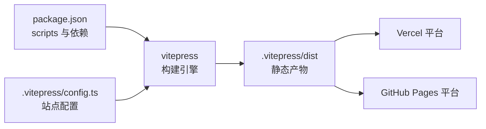

# 部署指南

<cite>
**本文引用的文件**
- [package.json](file://package.json)
- [.vitepress/config.ts](file://.vitepress/config.ts)
- [README.md](file://README.md)
- [index.md](file://index.md)
- [about.md](file://about.md)
- [projects.md](file://projects.md)
- [links.md](file://links.md)
- [posts/index.md](file://posts/index.md)
- [posts/frontend/vue3-tips.md](file://posts/frontend/vue3-tips.md)
- [posts/life/hello-world.md](file://posts/life/hello-world.md)
</cite>

## 目录
1. [简介](#简介)
2. [项目结构](#项目结构)
3. [核心组件](#核心组件)
4. [架构总览](#架构总览)
5. [详细组件分析](#详细组件分析)
6. [依赖分析](#依赖分析)
7. [性能考虑](#性能考虑)
8. [故障排查指南](#故障排查指南)
9. [结论](#结论)
10. [附录](#附录)

## 简介
本指南面向希望将基于 VitePress 的静态博客部署到不同平台的用户，覆盖 Vercel 与 GitHub Pages 的完整流程，解释构建命令与输出目录的作用，并提供部署前准备、部署后验证与常见问题排查建议。同时给出两种平台的优缺点对比与选择建议，帮助你在不同需求下做出合适决策。

## 项目结构
该仓库采用 VitePress 默认的静态站点组织方式：
- 站点配置位于 .vitepress/config.ts，定义站点标题、导航、侧边栏、SEO、主题与搜索等。
- 页面内容以 Markdown 文件组织，根目录与 posts 子目录分别存放首页、关于、项目、友链、文章归档及具体文章。
- 构建脚本通过 package.json 中的 scripts 定义，使用 vitepress 提供的 dev/build/preview 命令。
- public 目录用于放置静态资源（如头像、图标等）。

**图表来源**
- [package.json:1-23](file://package.json#L1-L23)
- [.vitepress/config.ts:1-95](file://.vitepress/config.ts#L1-L95)
- [README.md:14-34](file://README.md#L14-L34)

**章节来源**
- [README.md:14-34](file://README.md#L14-L34)
- [package.json:6-10](file://package.json#L6-L10)
- [.vitepress/config.ts:3-94](file://.vitepress/config.ts#L3-L94)

## 核心组件
- 构建脚本与命令
  - 开发：vitepress dev
  - 构建：vitepress build
  - 预览：vitepress preview
- 站点配置
  - 标题、描述、语言、SEO 头部标签
  - 导航、侧边栏、社交链接、页脚
  - 搜索（本地）、目录大纲、更新时间等
- 页面内容
  - 首页、关于、项目、友链、文章归档与具体文章
  - Markdown Front Matter 控制页面元数据与布局

**章节来源**
- [package.json:6-10](file://package.json#L6-L10)
- [.vitepress/config.ts:3-94](file://.vitepress/config.ts#L3-L94)
- [index.md:1-30](file://index.md#L1-L30)
- [about.md:1-41](file://about.md#L1-L41)
- [projects.md:1-34](file://projects.md#L1-L34)
- [links.md:1-43](file://links.md#L1-L43)
- [posts/index.md:1-24](file://posts/index.md#L1-L24)
- [posts/frontend/vue3-tips.md:1-57](file://posts/frontend/vue3-tips.md#L1-L57)
- [posts/life/hello-world.md:1-37](file://posts/life/hello-world.md#L1-L37)

## 架构总览
下图展示了从源码到部署产物的关键路径：本地开发与构建、VitePress 配置、构建产物输出目录，以及最终在不同平台上的发布形态。

**图表来源**
- [package.json:6-10](file://package.json#L6-L10)
- [README.md:75-84](file://README.md#L75-L84)

## 详细组件分析

### Vercel 部署流程
- 准备工作
  - 将项目推送到 GitHub 仓库
  - 在 Vercel 导入该仓库
- 平台配置
  - 构建命令：pnpm build
  - 输出目录：.vitepress/dist
- 验证与发布
  - Vercel 自动检测构建并生成预览链接
  - 绑定自定义域名后生效
- 注意事项
  - 确保构建命令与输出目录与 README 中一致
  - 若使用 pnpm，确保 Vercel 项目设置为 pnpm 包管理器
  - 如需环境变量或重定向规则，可在 Vercel 控制台配置

**图表来源**
- [README.md:75-81](file://README.md#L75-L81)

**章节来源**
- [README.md:75-81](file://README.md#L75-L81)

### GitHub Pages 部署流程
- 准备工作
  - 选择发布分支：通常使用 gh-pages 分支或使用 GitHub Actions 自动部署到 gh-pages
  - 若使用 Actions，可参考官方 VitePress 部署文档进行配置
- 关键步骤
  - 在仓库设置中启用 Pages 功能，选择正确的源分支与根目录
  - 若需要自定义域名，配置 CNAME 文件并设置 DNS 记录
- 注意事项
  - 确保构建命令与输出目录与 README 中一致
  - 若使用子路径部署，需在站点配置中设置 base 路径（如适用）
  - 验证静态资源路径是否正确（public 目录下的资源需注意相对路径）

**图表来源**
- [README.md:82-84](file://README.md#L82-L84)

**章节来源**
- [README.md:82-84](file://README.md#L82-L84)

### 构建命令与输出目录详解
- 构建命令：pnpm build
  - 作用：调用 VitePress 的构建流程，生成静态站点
  - 依赖：package.json 中的脚本与 VitePress 依赖
- 输出目录：.vitepress/dist
  - 作用：存放构建生成的静态文件，包括 HTML、CSS、JS 与 public 目录下的资源
  - 平台要求：Vercel 与 GitHub Pages 均需指向该目录作为发布源

**图表来源**
- [package.json:6-10](file://package.json#L6-L10)
- [README.md:79-80](file://README.md#L79-L80)

**章节来源**
- [package.json:6-10](file://package.json#L6-L10)
- [README.md:79-80](file://README.md#L79-L80)

### 部署前准备清单
- 域名与 CNAME
  - 若使用自定义域名，需在平台控制台绑定域名，并在仓库根目录添加 CNAME 文件（内容为域名）
  - 配置 DNS 记录（如 A 记录或 CNAME），确保解析到目标平台
- 站点基础配置
  - 在 .vitepress/config.ts 中确认标题、描述、导航、侧边栏等
  - 确认 public 目录下的静态资源路径正确
- 构建与发布
  - 本地先执行 pnpm build 预检，确认无错误
  - 在平台设置中配置构建命令与输出目录，保持与 README 一致

**章节来源**
- [README.md:75-84](file://README.md#L75-L84)
- [.vitepress/config.ts:3-94](file://.vitepress/config.ts#L3-L94)

## 依赖分析
- 构建链路
  - package.json 中的 scripts 依赖 vitepress 与 vue
  - VitePress 依据 .vitepress/config.ts 生成站点结构与页面
- 平台适配
  - Vercel：支持 pnpm，自动识别构建命令与输出目录
  - GitHub Pages：支持直接发布 dist 目录或通过 Actions 发布

**图表来源**
- [package.json:6-21](file://package.json#L6-L21)
- [.vitepress/config.ts:1-95](file://.vitepress/config.ts#L1-L95)

**章节来源**
- [package.json:6-21](file://package.json#L6-L21)
- [.vitepress/config.ts:1-95](file://.vitepress/config.ts#L1-L95)

## 性能考虑
- 构建优化
  - 使用 pnpm 以提升安装与构建速度
  - 避免在 public 目录放置过大资源，必要时使用 CDN
- 静态资源
  - 合理组织图片与字体，减少首屏加载时间
  - 利用浏览器缓存策略，提升回访体验
- 平台选择
  - Vercel：全球加速、自动 HTTPS、按需扩缩容
  - GitHub Pages：免费、稳定、适合开源项目

[本节为通用建议，不涉及具体文件分析]

## 故障排查指南
- 构建失败
  - 检查 package.json 中的构建命令是否正确
  - 确认 .vitepress/config.ts 中无语法错误
  - 本地先执行 pnpm build，定位报错后再提交到平台
- 输出目录不正确
  - 确认平台设置中的输出目录为 .vitepress/dist
  - 若使用子路径部署，检查站点配置中的 base 设置
- 自定义域名无法访问
  - 检查 CNAME 文件内容与 DNS 解析状态
  - 确认平台已启用自定义域名并完成验证
- 资源 404
  - 检查 public 目录资源路径是否正确
  - 确认静态资源未被忽略或路径拼接错误

**章节来源**
- [README.md:75-84](file://README.md#L75-L84)
- [.vitepress/config.ts:3-94](file://.vitepress/config.ts#L3-L94)

## 结论
本指南提供了基于 VitePress 的博客在 Vercel 与 GitHub Pages 上的完整部署路径，明确了构建命令与输出目录的关键作用，并给出了部署前准备、验证与排错建议。结合两种平台的特点，你可以根据自身需求（成本、功能、运维复杂度）做出选择。

[本节为总结性内容，不涉及具体文件分析]

## 附录

### 不同部署平台的优缺点与选择建议
- Vercel
  - 优点：全球分发、自动 HTTPS、快速部署、生态友好（pnpm 支持好）
  - 缺点：部分高级功能可能需要付费计划
  - 适合：追求部署效率与全球访问体验的个人站点
- GitHub Pages
  - 优点：完全免费、与 GitHub 一体化、适合开源项目
  - 缺点：CDN 与全球加速能力有限，自定义域名配置较繁琐
  - 适合：预算有限或仅需静态展示的个人博客

[本节为通用建议，不涉及具体文件分析]