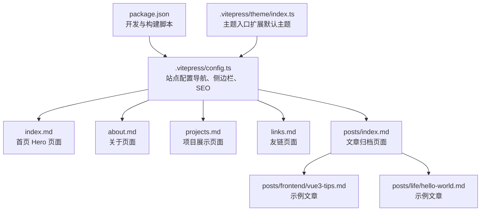
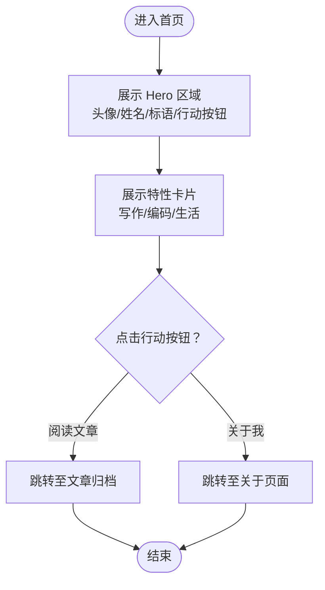
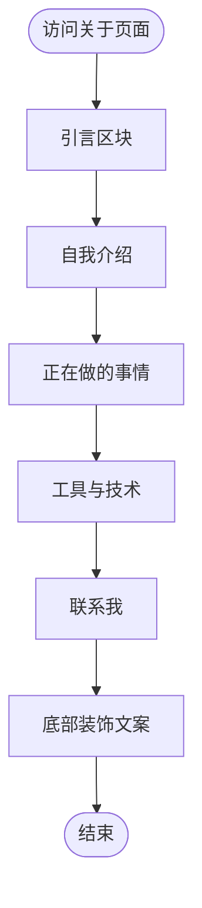
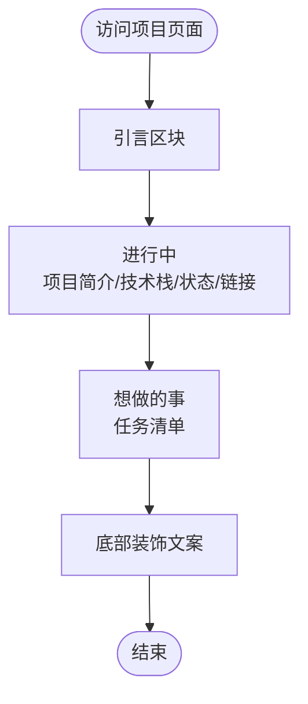
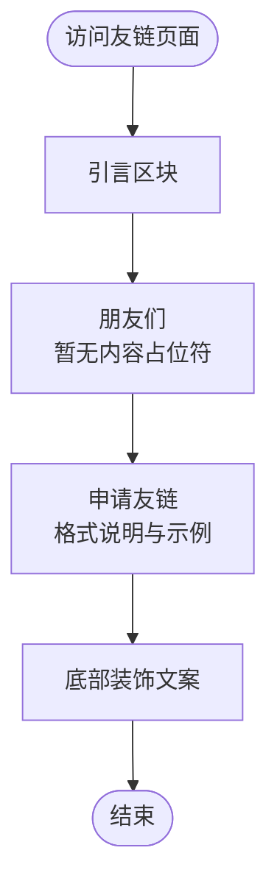
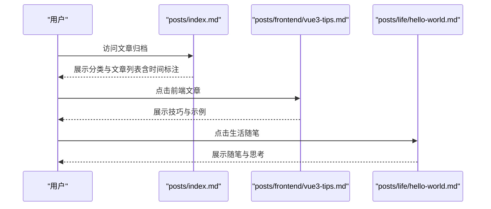
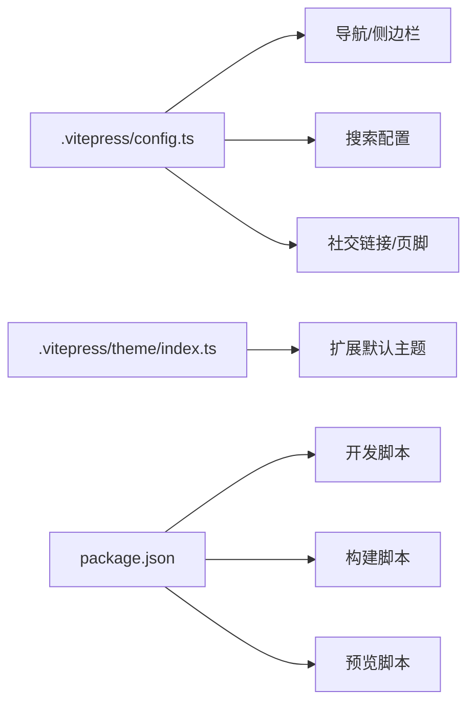

# 页面设计

<cite>
**本文引用的文件**
- [index.md](file://index.md)
- [about.md](file://about.md)
- [projects.md](file://projects.md)
- [links.md](file://links.md)
- [.vitepress/config.ts](file://.vitepress/config.ts)
- [posts/index.md](file://posts/index.md)
- [posts/frontend/vue3-tips.md](file://posts/frontend/vue3-tips.md)
- [posts/life/hello-world.md](file://posts/life/hello-world.md)
- [package.json](file://package.json)
- [README.md](file://README.md)
- [.vitepress/theme/index.ts](file://.vitepress/theme/index.ts)
</cite>

## 目录
1. [引言](#引言)
2. [项目结构](#项目结构)
3. [核心组件](#核心组件)
4. [架构总览](#架构总览)
5. [详细组件分析](#详细组件分析)
6. [依赖分析](#依赖分析)
7. [性能考虑](#性能考虑)
8. [故障排查指南](#故障排查指南)
9. [结论](#结论)
10. [附录](#附录)

## 引言
本文件面向页面设计系统，围绕首页 Hero 页面、关于页面、项目展示页面与友链页面进行系统化说明。内容涵盖各页面的 Markdown 结构、内容组织方式、视觉呈现要点、页面间导航关系与用户体验设计考量；同时提供页面内容编辑指导（文本格式、链接添加、图片插入等）、响应式设计与移动端适配策略、最佳实践与个性化定制建议。

## 项目结构
该站点采用 VitePress 静态站点生成器，核心由站点配置、页面 Markdown、主题扩展与构建脚本构成。页面以 Markdown 文件形式组织，通过 VitePress 的默认主题与自定义主题入口进行渲染与样式注入。



**图表来源**
- [.vitepress/config.ts:1-95](file://.vitepress/config.ts#L1-L95)
- [index.md:1-30](file://index.md#L1-L30)
- [about.md:1-41](file://about.md#L1-L41)
- [projects.md:1-34](file://projects.md#L1-L34)
- [links.md:1-43](file://links.md#L1-L43)
- [posts/index.md:1-24](file://posts/index.md#L1-L24)
- [posts/frontend/vue3-tips.md:1-57](file://posts/frontend/vue3-tips.md#L1-L57)
- [posts/life/hello-world.md:1-37](file://posts/life/hello-world.md#L1-L37)
- [package.json:1-23](file://package.json#L1-L23)
- [.vitepress/theme/index.ts:1-8](file://.vitepress/theme/index.ts#L1-L8)

**章节来源**
- [.vitepress/config.ts:1-95](file://.vitepress/config.ts#L1-L95)
- [README.md:14-50](file://README.md#L14-L50)
- [package.json:6-10](file://package.json#L6-L10)

## 核心组件
- 站点配置（导航、侧边栏、SEO、搜索、社交链接、页脚等）
- 主题入口（扩展 VitePress 默认主题）
- 页面 Markdown（首页 Hero、关于、项目、友链、文章归档与示例文章）

这些组件共同决定了页面的导航关系、内容组织与视觉呈现。

**章节来源**
- [.vitepress/config.ts:16-93](file://.vitepress/config.ts#L16-L93)
- [.vitepress/theme/index.ts:1-8](file://.vitepress/theme/index.ts#L1-L8)
- [index.md:1-30](file://index.md#L1-L30)
- [about.md:1-41](file://about.md#L1-L41)
- [projects.md:1-34](file://projects.md#L1-L34)
- [links.md:1-43](file://links.md#L1-L43)
- [posts/index.md:1-24](file://posts/index.md#L1-L24)

## 架构总览
下图展示了从站点配置到页面渲染的整体流程：站点配置定义导航与侧边栏，主题入口扩展默认主题，页面 Markdown 作为内容源，最终由 VitePress 渲染为静态页面。

```mermaid
sequenceDiagram
participant CFG as ".vitepress/config.ts"
participant THEME as ".vitepress/theme/index.ts"
participant HOME as "index.md"
participant ABOUT as "about.md"
participant PROJ as "projects.md"
participant LINKS as "links.md"
participant POSTS as "posts/index.md"
participant VP as "VitePress 渲染引擎"
CFG->>VP : 加载站点配置导航、侧边栏、SEO、搜索
THEME->>VP : 扩展默认主题
VP->>HOME : 渲染首页 Hero 页面
VP->>ABOUT : 渲染关于页面
VP->>PROJ : 渲染项目展示页面
VP->>LINKS : 渲染友链页面
VP->>POSTS : 渲染文章归档页面
```

**图表来源**
- [.vitepress/config.ts:16-93](file://.vitepress/config.ts#L16-L93)
- [.vitepress/theme/index.ts:1-8](file://.vitepress/theme/index.ts#L1-L8)
- [index.md:1-30](file://index.md#L1-L30)
- [about.md:1-41](file://about.md#L1-L41)
- [projects.md:1-34](file://projects.md#L1-L34)
- [links.md:1-43](file://links.md#L1-L43)
- [posts/index.md:1-24](file://posts/index.md#L1-L24)

## 详细组件分析

### 首页 Hero 页面
- 设计理念
  - 以“人”为核心，强调个人品牌与温度感，通过头像、昵称、标语与行动按钮建立第一印象。
  - 使用特性卡片（写作、编码、生活）快速传达内容方向与价值主张。
- Markdown 结构与内容组织
  - YAML 头部：声明页面布局为首页布局。
  - hero 字段：包含姓名、标语、头像与两个行动按钮（品牌与次要风格）。
  - features 字段：三个图标 + 标题 + 细节说明，形成轻量信息块。
- 视觉呈现
  - 头像路径指向公共资源，确保跨页面加载稳定。
  - 行动按钮链接至文章列表与关于页面，引导用户深入。
- 用户体验设计
  - 首屏信息密度适中，避免认知负荷；功能入口清晰，便于探索。
  - 特性卡片以图标增强识别度，细节说明提供进一步动机。



**图表来源**
- [index.md:4-29](file://index.md#L4-L29)

**章节来源**
- [index.md:1-30](file://index.md#L1-L30)

### 关于页面
- 设计理念
  - 以“人”为中心，强调真实与温度，通过引言、自我介绍、技能与联系信息构建信任。
- Markdown 结构与内容组织
  - YAML 头部：标题与描述用于 SEO。
  - 引言区块：一句具有温度的开篇语。
  - 小节划分：自我介绍、正在做的事情、工具与技术、联系方式。
  - 代码块：以结构化文本列出语言、框架、工具与关注点。
  - 底部装饰性文案：提升阅读体验。
- 视觉呈现
  - 使用块引用与标题层级，营造阅读节奏。
  - 代码块用于信息密度较高的技能清单，便于扫描。
- 用户体验设计
  - 信息分层清晰，便于快速定位“你是谁”“你能做什么”“如何联系”。



**图表来源**
- [about.md:8-40](file://about.md#L8-L40)

**章节来源**
- [about.md:1-41](file://about.md#L1-L41)

### 项目展示页面
- 设计理念
  - 展示“进行中”的成果与“想做的事”，体现成长轨迹与未来方向。
- Markdown 结构与内容组织
  - YAML 头部：标题与描述。
  - 引言区块：一句富有哲理的开篇语。
  - 小节划分：进行中、想做的事（含任务清单）。
  - 底部装饰性文案：传递节奏与态度。
- 视觉呈现
  - 列表与标题层级清晰，任务清单增强可读性。
- 用户体验设计
  - “进行中”与“想做的事”形成对比，既展示成果也表达愿景。



**图表来源**
- [projects.md:10-28](file://projects.md#L10-L28)

**章节来源**
- [projects.md:1-34](file://projects.md#L1-L34)

### 友链页面
- 设计理念
  - 以“连接”为主题，营造开放与互动氛围；提供申请格式与站点信息，降低协作门槛。
- Markdown 结构与内容组织
  - YAML 头部：标题与描述。
  - 引言区块：富有诗意的开篇语。
  - 小节划分：朋友们（暂为空，提示等待相遇）、申请友链（格式说明与示例）。
  - 底部装饰性文案：传递温暖与期待。
- 视觉呈现
  - 注释占位符提示当前状态，配合文案减少空页面带来的落差感。
- 用户体验设计
  - 明确的申请格式与示例，降低参与成本；底部文案增强情感连接。



**图表来源**
- [links.md:10-36](file://links.md#L10-L36)

**章节来源**
- [links.md:1-43](file://links.md#L1-L43)

### 文章归档与示例文章
- 文章归档页面
  - 通过 YAML 头部设置标题，使用分级标题组织年份与分类，列表项内嵌时间标注，底部装饰文案。
- 示例文章（前端技巧与生活随笔）
  - YAML 头部包含标题、日期、分类、标签与描述。
  - 使用块引用引入观点，章节化组织知识点与随笔内容。
  - 底部总结性引文提升阅读收束感。



**图表来源**
- [posts/index.md:9-17](file://posts/index.md#L9-L17)
- [posts/frontend/vue3-tips.md:15-27](file://posts/frontend/vue3-tips.md#L15-L27)
- [posts/life/hello-world.md:25-36](file://posts/life/hello-world.md#L25-L36)

**章节来源**
- [posts/index.md:1-24](file://posts/index.md#L1-L24)
- [posts/frontend/vue3-tips.md:1-57](file://posts/frontend/vue3-tips.md#L1-L57)
- [posts/life/hello-world.md:1-37](file://posts/life/hello-world.md#L1-L37)

## 依赖分析
- 站点配置依赖
  - 导航与侧边栏：决定页面间的可达性与内容索引。
  - 搜索配置：影响站内检索体验。
  - 社交链接与页脚：强化站点身份与版权信息。
- 主题依赖
  - 主题入口扩展默认主题，保证样式与交互的一致性。
- 构建与运行
  - 开发、构建与预览脚本由包管理脚本统一管理。



**图表来源**
- [.vitepress/config.ts:20-54](file://.vitepress/config.ts#L20-L54)
- [.vitepress/theme/index.ts:1-8](file://.vitepress/theme/index.ts#L1-L8)
- [package.json:6-10](file://package.json#L6-L10)

**章节来源**
- [.vitepress/config.ts:16-93](file://.vitepress/config.ts#L16-L93)
- [.vitepress/theme/index.ts:1-8](file://.vitepress/theme/index.ts#L1-L8)
- [package.json:1-23](file://package.json#L1-L23)

## 性能考虑
- 静态生成：VitePress 生成静态页面，首屏加载速度快，利于 SEO。
- 资源优化：合理放置头像等静态资源，避免重复请求与跨域问题。
- 导航与侧边栏：精简导航层级，减少不必要的页面跳转。
- 搜索本地化：本地搜索适合中小型站点，避免外部依赖带来的性能波动。
- 构建缓存：利用 Vite 的构建缓存与增量编译，缩短开发与构建时间。

## 故障排查指南
- 页面无法访问或空白
  - 检查站点配置中的导航与侧边栏是否正确指向目标页面。
  - 确认页面 Markdown 的 YAML 头部语法正确，字段完整。
- 图片/头像不显示
  - 确认资源路径正确且位于公共目录，路径大小写敏感。
- 导航缺失或错误
  - 若新增页面，请同步更新站点配置中的导航与侧边栏。
- 搜索无结果
  - 检查搜索提供者与翻译配置是否正确。
- 本地开发异常
  - 使用提供的脚本启动开发服务器，确认依赖安装完成。

**章节来源**
- [.vitepress/config.ts:20-93](file://.vitepress/config.ts#L20-L93)
- [README.md:52-71](file://README.md#L52-L71)

## 结论
本页面设计系统以“人”为核心，通过首页 Hero、关于、项目与友链页面构建完整的个人品牌叙事；结合文章归档与示例文章，形成内容生态闭环。站点配置与主题入口确保一致的导航、搜索与视觉体验；静态生成与本地搜索兼顾性能与可用性。遵循本文的编辑与适配建议，可进一步提升内容质量与用户体验。

## 附录

### 页面内容编辑指导
- 文本格式
  - 使用标题层级组织内容，保持段落简洁。
  - 引用块用于观点引入，增强可读性。
- 链接添加
  - 内部链接使用相对路径；外部链接使用绝对 URL。
  - 新增文章后，记得在站点配置的侧边栏中补充链接。
- 图片插入
  - 将图片放入公共目录，使用相对路径引用。
  - 为图片提供替代文本（alt），提升可访问性。
- YAML 头部
  - 标题、描述、日期、分类、标签等字段有助于 SEO 与内容管理。

**章节来源**
- [README.md:52-71](file://README.md#L52-L71)
- [.vitepress/config.ts:28-44](file://.vitepress/config.ts#L28-L44)

### 响应式设计与移动端适配
- VitePress 默认主题已具备基础响应式能力，建议：
  - 控制首屏信息密度，优先展示关键信息。
  - 使用简洁的图标与标题，避免在窄屏下拥挤。
  - 适当调整字体大小与行高，提升移动端阅读体验。
  - 在主题入口处按需扩展样式，确保跨设备一致性。

**章节来源**
- [.vitepress/theme/index.ts:1-8](file://.vitepress/theme/index.ts#L1-L8)
- [.vitepress/config.ts:16-93](file://.vitepress/config.ts#L16-L93)

### 最佳实践与个性化定制建议
- 内容策略
  - 保持内容节奏：短小精悍的章节与清晰的标题层级。
  - 重视“关于”与“项目”页面，它们是访客了解你的关键入口。
- 导航与索引
  - 导航尽量不超过 5 个主要入口，避免信息过载。
  - 侧边栏按分类组织，便于深度阅读。
- 视觉与品牌
  - 统一头像风格与色彩体系，强化个人品牌识别。
  - 使用少量装饰性文案与引用块，提升格调。
- 可访问性
  - 为图片提供替代文本，确保在降级环境下仍可理解。
  - 保持足够的对比度与字号，照顾不同设备与视力条件。