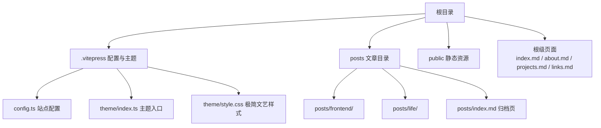
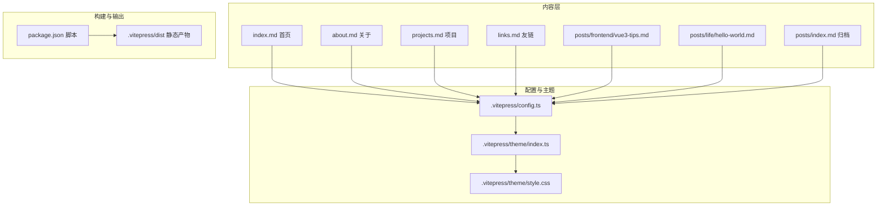
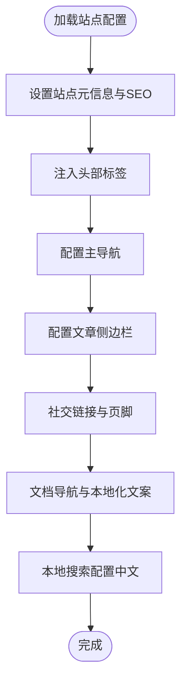
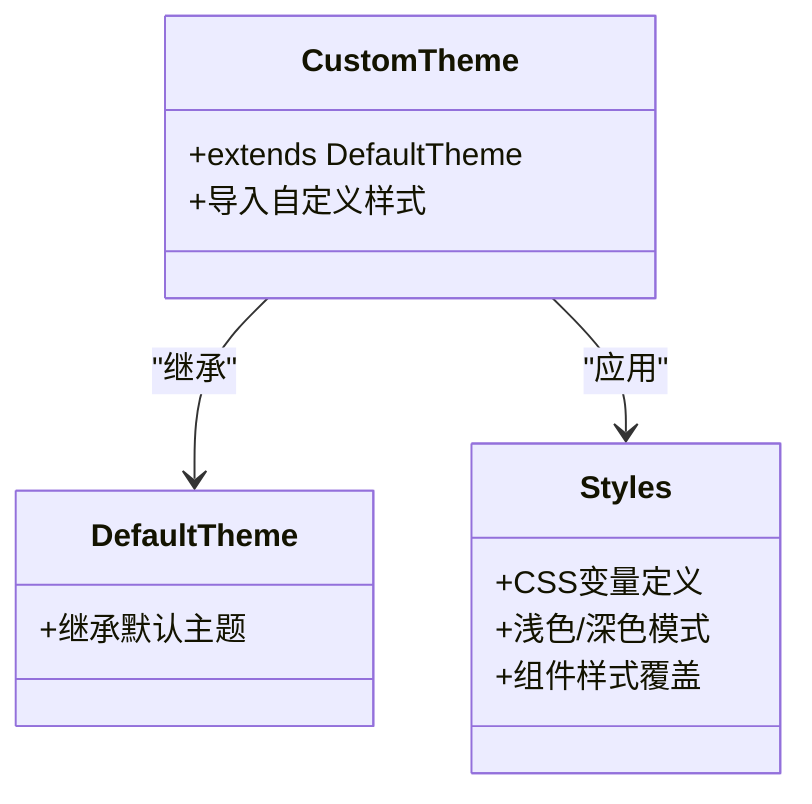
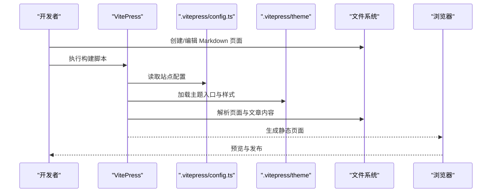
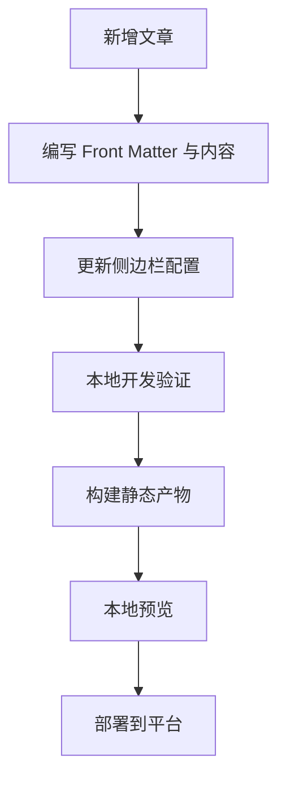
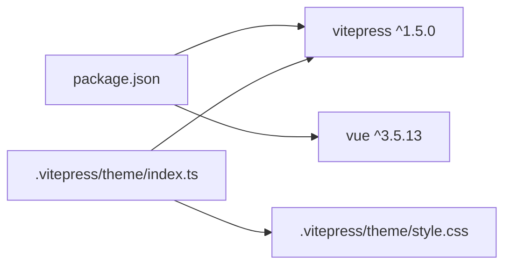

# 项目概述

<cite>
**本文档引用的文件**
- [README.md](file://README.md)
- [package.json](file://package.json)
- [.vitepress/config.ts](file://.vitepress/config.ts)
- [.vitepress/theme/index.ts](file://.vitepress/theme/index.ts)
- [.vitepress/theme/style.css](file://.vitepress/theme/style.css)
- [index.md](file://index.md)
- [about.md](file://about.md)
- [projects.md](file://projects.md)
- [links.md](file://links.md)
- [posts/index.md](file://posts/index.md)
- [posts/frontend/vue3-tips.md](file://posts/frontend/vue3-tips.md)
- [posts/life/hello-world.md](file://posts/life/hello-world.md)
</cite>

## 目录
1. [引言](#引言)
2. [项目结构](#项目结构)
3. [核心组件](#核心组件)
4. [架构总览](#架构总览)
5. [详细组件分析](#详细组件分析)
6. [依赖关系分析](#依赖关系分析)
7. [性能考虑](#性能考虑)
8. [故障排除指南](#故障排除指南)
9. [结论](#结论)
10. [附录](#附录)

## 引言
本项目是一个基于 VitePress 的个人静态博客，采用极简文艺风格设计，强调“克制的黑白灰”主色调、衬线字体与留白的平衡，营造出宁静致远的阅读体验。项目通过 Markdown 内容驱动，结合 VitePress 的静态站点生成能力，实现从内容到页面的一键构建与部署。对于初学者，项目提供了清晰的起步流程与写作规范；对于有经验的开发者，项目展示了主题定制、本地搜索、导航与侧边栏配置等架构层面的实践。

## 项目结构
项目采用“内容优先”的组织方式，核心目录如下：
- .vitepress：站点配置与主题扩展
  - config.ts：站点元数据、导航、侧边栏、SEO、搜索、页脚等配置
  - theme：主题扩展与样式覆盖
    - index.ts：继承默认主题并引入样式
    - style.css：极简文艺风的 CSS 变量与组件样式
- posts：文章内容，按分类组织（如 frontend、life）
- public：静态资源（如头像）
- 根级文档：首页、关于、项目、友链等页面
- package.json：脚本与依赖声明

图表来源
- [README.md:14-34](file://README.md#L14-L34)
- [.vitepress/config.ts:1-95](file://.vitepress/config.ts#L1-L95)
- [.vitepress/theme/index.ts:1-8](file://.vitepress/theme/index.ts#L1-L8)
- [.vitepress/theme/style.css:1-142](file://.vitepress/theme/style.css#L1-L142)

章节来源
- [README.md:14-34](file://README.md#L14-L34)

## 核心组件
- 站点配置（VitePress）：统一管理站点标题、描述、语言、SEO 头部标签、导航、侧边栏、社交链接、页脚、文档导航、搜索、深浅色主题开关等。
- 主题扩展：继承默认主题，注入自定义样式，实现极简文艺风格。
- 页面与内容：首页（Hero + 特性）、关于、项目、友链、文章归档、分类文章等。
- 构建与脚本：通过 package.json 的 dev/build/preview 脚本驱动 VitePress。

章节来源
- [.vitepress/config.ts:3-94](file://.vitepress/config.ts#L3-L94)
- [.vitepress/theme/index.ts:5-7](file://.vitepress/theme/index.ts#L5-L7)
- [.vitepress/theme/style.css:1-142](file://.vitepress/theme/style.css#L1-L142)
- [package.json:6-10](file://package.json#L6-L10)

## 架构总览
下图展示从内容到页面的生成与渲染路径，以及主题样式注入的关键节点。

图表来源
- [.vitepress/config.ts:3-94](file://.vitepress/config.ts#L3-L94)
- [.vitepress/theme/index.ts:1-8](file://.vitepress/theme/index.ts#L1-L8)
- [.vitepress/theme/style.css:1-142](file://.vitepress/theme/style.css#L1-L142)
- [package.json:6-10](file://package.json#L6-L10)

## 详细组件分析

### VitePress 配置组件
- 元信息与 SEO：站点标题、描述、语言、清理 URL、最近更新时间等。
- 头部标签：图标、作者、关键词等。
- 导航与侧边栏：主导航（首页/文章/项目/关于/友链）与文章侧边栏（按分类展开）。
- 社交链接、页脚、文档导航、搜索（本地搜索，含中文文案）。
- 主题行为：深浅色切换、返回顶部、侧边栏菜单文本等本地化文案。

图表来源
- [.vitepress/config.ts:3-94](file://.vitepress/config.ts#L3-L94)

章节来源
- [.vitepress/config.ts:3-94](file://.vitepress/config.ts#L3-L94)

### 主题扩展与样式组件
- 主题入口：继承默认主题，确保 VitePress 默认行为可用，同时引入自定义样式。
- 样式策略：通过 CSS 变量定义主色调、背景与文字色阶；区分浅色与深色模式；针对首页 Hero、标题、引用、链接、代码块、导航栏、文章卡片等组件进行精细化样式覆盖。

图表来源
- [.vitepress/theme/index.ts:1-8](file://.vitepress/theme/index.ts#L1-L8)
- [.vitepress/theme/style.css:1-142](file://.vitepress/theme/style.css#L1-L142)

章节来源
- [.vitepress/theme/index.ts:1-8](file://.vitepress/theme/index.ts#L1-L8)
- [.vitepress/theme/style.css:1-142](file://.vitepress/theme/style.css#L1-L142)

### 页面与内容组件
- 首页（index.md）：使用 Home 布局，包含 Hero 区域（姓名、标语、头像、操作按钮）与特性卡片。
- 关于（about.md）：个人信息、技能与工具、联系方式等。
- 项目（projects.md）：当前项目与未来计划。
- 友链（links.md）：友链申请模板与站点信息。
- 文章归档（posts/index.md）：按年份与分类展示文章列表。
- 分类文章：如前端技巧与生活随笔，遵循 Front Matter 规范（标题、日期、分类、标签、描述）。

图表来源
- [package.json:6-10](file://package.json#L6-L10)
- [.vitepress/config.ts:3-94](file://.vitepress/config.ts#L3-L94)
- [.vitepress/theme/index.ts:1-8](file://.vitepress/theme/index.ts#L1-L8)
- [.vitepress/theme/style.css:1-142](file://.vitepress/theme/style.css#L1-L142)

章节来源
- [index.md:1-30](file://index.md#L1-L30)
- [about.md:1-41](file://about.md#L1-L41)
- [projects.md:1-34](file://projects.md#L1-L34)
- [links.md:1-43](file://links.md#L1-L43)
- [posts/index.md:1-24](file://posts/index.md#L1-L24)
- [posts/frontend/vue3-tips.md:1-57](file://posts/frontend/vue3-tips.md#L1-L57)
- [posts/life/hello-world.md:1-37](file://posts/life/hello-world.md#L1-L37)

### 写作与发布流程
- 写作：在 posts/<分类>/ 下新增 Markdown 文件，遵循 Front Matter 规范。
- 导航与索引：在 .vitepress/config.ts 的 sidebar 中添加新文章链接。
- 本地开发：使用 pnpm dev 启动开发服务器。
- 构建与预览：使用 pnpm build 生成静态产物，pnpm preview 本地预览。
- 部署：支持 Vercel（指定构建命令与输出目录）与 GitHub Pages。

图表来源
- [README.md:52-84](file://README.md#L52-L84)
- [.vitepress/config.ts:28-45](file://.vitepress/config.ts#L28-L45)

章节来源
- [README.md:36-50](file://README.md#L36-L50)
- [README.md:52-84](file://README.md#L52-L84)

## 依赖关系分析
- 依赖声明：VitePress 1.x 与 Vue 3 作为核心依赖。
- 脚本命令：dev/build/preview 三个命令分别对应开发、构建与预览。
- 主题依赖：通过继承默认主题并引入自定义样式，形成“默认行为 + 自定义外观”的组合。

图表来源
- [package.json:18-22](file://package.json#L18-L22)
- [.vitepress/theme/index.ts:1-3](file://.vitepress/theme/index.ts#L1-L3)
- [.vitepress/theme/style.css:1-4](file://..vitepress/theme/style.css#L1-L4)

章节来源
- [package.json:18-22](file://package.json#L18-L22)

## 性能考虑
- 静态生成：VitePress 将 Markdown 渲染为静态 HTML，减少运行时开销，提升首屏性能。
- 轻量主题：通过 CSS 变量与最小化样式覆盖，避免冗余样式，降低打包体积。
- 本地搜索：使用本地搜索减少外部依赖，提升搜索性能与隐私性。
- 图片与资源：建议将头像等静态资源放入 public 目录，利用 CDN 或平台缓存。

## 故障排除指南
- 构建失败：检查 package.json 中的脚本是否正确，确认依赖安装完整。
- 侧边栏未显示：确认 .vitepress/config.ts 的 sidebar 中已添加新文章链接。
- 样式异常：检查 .vitepress/theme/style.css 是否正确引入，确认 CSS 变量命名与覆盖顺序。
- 部署问题：Vercel 需确保构建命令与输出目录配置正确；GitHub Pages 遵循官方部署文档。

章节来源
- [README.md:73-84](file://README.md#L73-L84)
- [.vitepress/config.ts:28-45](file://.vitepress/config.ts#L28-L45)
- [.vitepress/theme/style.css:1-142](file://.vitepress/theme/style.css#L1-L142)

## 结论
本项目以极简文艺为核心设计理念，通过 VitePress 的静态站点生成能力与 Vue3 的响应式特性，实现了从内容创作到页面发布的高效闭环。其主题定制与样式覆盖体现了“少即是多”的设计哲学，既适合初学者快速上手，也为进阶用户提供了可扩展的架构空间。建议在持续写作的同时，逐步完善分类体系与搜索体验，以提升长期维护与用户体验。

## 附录
- 技术栈：VitePress 1.x、Vue3、TypeScript、Vite
- 部署：Vercel（推荐）与 GitHub Pages
- 写作规范：Front Matter 字段（标题、日期、分类、标签、描述）

章节来源
- [README.md:7-12](file://README.md#L7-L12)
- [README.md:73-84](file://README.md#L73-L84)